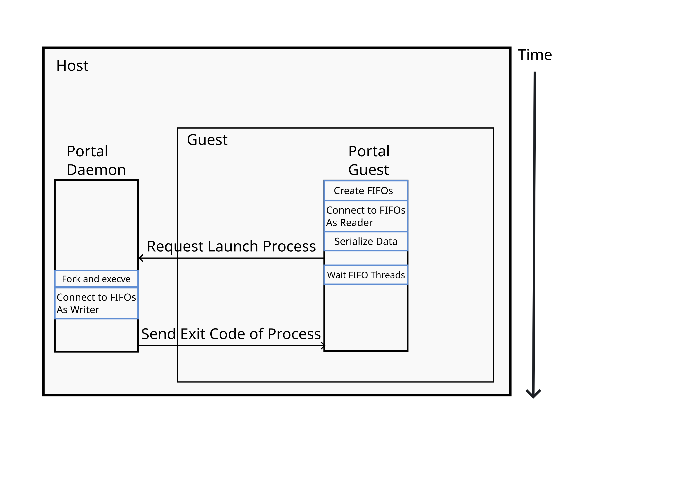

<p align="center">
  
</p>


# Table of contents

- [Table of contents](#table-of-contents)
- [FlatImage](#flatimage)
    - [What is it?](#what-is-it)
    - [How to use](#how-to-use)
    - [How it works](#how-it-works)
- [Environment Variables](#environment-variables)
    - [What is it?](#what-is-it)
    - [How to use](#how-to-use)
    - [How it works](#how-it-works)
- [Desktop Integration](#desktop-integration)
    - [What is it?](#what-is-it)
    - [How to Use](#how-to-use)
    - [How it Works](#how-it-works)
- [Transparent Command Portal](#transparent-command-portal)
    - [What is it?](#what-is-it)
    - [How to Use](#how-to-use)
    - [How it Works](#how-it-works)
- [Motivations](#motivations)
- [Related Projects](#related-projects)

# FlatImage

## What is it?

FlatImage, is a hybrid of [Flatpak](https://github.com/flatpak/flatpak)
sandboxing with [AppImage](https://github.com/AppImage/AppImageKit) portability.

FlatImage use case is twofold:

* Flatimage is a package format, it includes a piece of software with all its
    dependencies for it work with across several linux distros (both Musl and
    GNU). Unlike `AppImage`, FlatImage runs the application in a container by
    default, which increases portability and compatibility at the cost of file
    size.

* Flatimage is a portable container image that requires no superuser permissions to run.

The diverse `GNU/Linux` ecosystem includes a vast array of distributions, each
with its own advantages and use cases. This can lead to cross-distribution
software compatibility challenges. FlatImage addresses these issues by:

* Utilizing its own root directory, enabling dynamic libraries with hard-coded
    paths to be packaged alongside the software without
    [binary patching](https://github.com/AppImage/AppImageKit/wiki/Bundling-Windows-applications).
* Running the application in its own gnu (or musl) environment, therefore, not using host
    libraries that might be outdated/incompatiblesystem with the application.

It simplifies the task of software packaging by enforcing the philosophy that it
should be as simple as setting up a container. This is an effort for the
end-user to not depend on the application developer to provide the portable
binary (or to handle how to package the application, dependencies and create a
runner script). It also increases the quality of life of the package developer,
simplifying the packaging process of applications.

**Comparison**:

| Feature                                                                   | FlatImage     | Docker                     | AppImage |
| :---                                                                      | :---:         | :---:                      | :---:    |
| No superuser privileges to use                                            | x             | x<sup>2</sup>              | x
| **Overlayfs** (allows to install programs even after compression)         | x             |                            |
| No installation necessary (click and use)                                 | x             | Requires docker on the host| x
| Requires building on an old system to minimize glibc issues               |               | N/A                        | x
| Mountable as a filesystem                                                 | x             | x                          | x<sup>3</sup>
| Runs without mounting the filesystem                                      |               |                            | x
| Straightforward build process                                             | x             | x                          |
| Desktop integration                                                       | x             |                            | x
| Extract the contents                                                      | x             | x                          | x
| Supports reconfiguration without rebuild                                  | x             | x (layers)                 |
| No host libraries used (Filesystem Isolation)                             | x             | x                          |
| Supports compression of specific directories/files in the package         | x             |                            |
| Portable mutable user configuration                                       | x             | x                          |
| Granular control over containerization                                    | x             | x                          |
| Works without fuse installed (still requires kernel support)              | x<sup>4</sup> | x                          | x<sup>5</sup>
| Layered filesystem                                                        | x (overlayfs) | x                          |
| Advanced networking management                                            |               | x                          |
| Advanced security features                                                |               | x                          |

> 1. Requires superuser privileges
> 1. Only if the user is part of the docker group
> 1. Only as read-only, you can mount FIM as read-write, before compression.
> 1. Works without libfuse/libfuse3, still requires fusermount to be available.
> 1. Experimental implementations, available [here](https://github.com/probonopd/go-appimage) and [here](https://github.com/AppImage/type2-runtime)

## How to use

**Get FlatImage**

You can get the latest release [here](https://github.com/ruanformigoni/flatimage/releases), and extract the compressed archive with your file manager or with `tar -xf some-file.tar.xz`. To verify the image integrity, you can use the `sha256sum` file that accompanies each release, like so: `sha256sum -c some-file.flatimage.sha256sum`.

**Execute The Container**

You can enter the container simply by executing the downloaded image, e.g.,
`./arch.flatimage`, which should give you a prompt like this `(flatimage@arch) →`.

To enter the container as root (to install software) use:
```
./arch.flatimage fim-root bash
```

**Create a portable firefox installation**

TODO

## How it works

A FlatImage contains a container where it executes its own commands apart
from the host system. With that in mind, it is possible to create applications
to run in different linux systems (distributions) without worrying about missing
binaries or libraries.

# Environment Variables

## What is it?
FlatImage provides a number of environment variables to query information about
directories, version, etc. These are separated in two groups, modifiable and
read-only:

**Modifiable**:

* `FIM_DEBUG`       : If defined to 1, print debug messages.
* `FIM_MAIN_OFFSET` : Shows filesystem offset and exits.

**Read-Only**:

* `FIM_VERSION`           : The version of the flatimage package
* `FIM_DIST`              : The linux distribution name (alpine, arch)
* `FIM_FILE_BINARY`       : Full path to the flatimage file
* `FIM_DIR_TEMP`          : Location of the runtime directory for instances of the current flatimage
* `FIM_DIR_MOUNT`         : Location of the runtime flatimage mountpoint
* `FIM_DIR_HOST_CONFIG`   : Configuration directory in the host machine

## How to use

To enable debugging you can use:

```bash
FIM_DEBUG=1 ./arch.flatimage
```

## How it works

FlatImage defines environment variables during its boot process, they are used
to convey information about the directories to mount filesystems and query data.

# Desktop Integration

## What is it?

The desktop integration allows flatimage programs to integrate themselves into the
start menu, show the application icon in the file manager and also define its
own mimetype.

## How to Use

**Configure**

You can use `./arch.flatimage fim-desktop` to get the following usage details:

```
fim-desktop:
   Configure the desktop integration
Usage:
   fim-desktop setup <json-file>
   fim-desktop enable <items...>
items:
   entry,mimetype,icon
Example:
   fim-desktop enable entry,mimetype,icon
```

To setup the desktop integration for a flatimage package, the first step is to
create a `json` file with the integration data, assume we create a file named
`desktop.json` with the following contents:

```json
{
  "name": "MyApp",
  "icon": "./my_app.png",
  "categories": ["System","Audio"]
}
```

This example creates the integration data for the application `MyApp`, with the
icon file `my_app.png` located in the same folder as `desktop.json`. The
categories field is used for the desktop menu entry integration, a list of valid
categories is found
[here](https://specifications.freedesktop.org/menu-spec/latest/category-registry.html#main-category-registry).
Let's assume the json file is called `desktop.json` and the flatimage file is
called `arch.flatimage`, the next command uses the `desktop.json` file to
configure the desktop integration.

```bash
$ ./arch.flatimage fim-desktop setup ./desktop.json
```

After the setup step, you can enable the integration selectively, `entry` refers
to the desktop entry in the start menu, `mimetype` refers to the file type that
appears in the file manager, `icon` is the application icon shown in the start
menu and the file manager. Here's how to enable everything:

```bash
$ ./arch.flatimage fim-desktop enable entry,mimetype,icon
```

**Erase entries**

To erase all desktop entries and icons created by flatimage, you can use the
command:

```bash
$ find ~/.local/share -iname "*flatimage*" -exec rm -v "{}" \;
```

**xdg-open**

Flatimage redirects `xdg-open` commands to the host machine

Examples:

* Open a video file with the host default video player: `xdg-open my-file.mkv`
* Open a link with the host default browser: `xdg-open www.google.com`

## How it Works

FlatImage installs desktop entries in `$HOME/.local/share/applications`, icons
are installed in `$HOME/.local/share/icons` and mimetypes are installed in
`$HOME/.local/share/mime`. The use must define `XDG_DATA_HOME` to `$HOME/.local/share`
or `XDG_DATA_DIRS` to contain the path `$HOME/.local/share`.

# Transparent Command Portal

## What is it?

Flatimage has a portal mechanism to execute commands in host machine, the output
and return code is returned in the guest as if the command was executed in it
(thus transparent).

## How to Use

Examples:
* Check if the host contains the thunar file manager: `fim_portal command -v thunar`
* Open thunar in the host machine: `fim_portal thunar`
* Open thunar in the host machine (full path): `fim_portal /bin/thunar`
* Open the desktop folder with thunar on the host machine: `fim_portal thunar ~/Desktop`

## How it Works



Three FIFOs are created, for `stdout`, `stderr` and the `exit code`, the guest
connects to the `stdout` and `stderr` FIFOs as a reader. The command to be
executed in the host machine and the paths to the FIFOs are
serialized to the host daemon; the daemon creates a child process and replaces
its `stdout` and `stderr` pipes with the provided FIFOs. After the command is
finished, the exit code is sent through the `exit` pipe and the guest process
exits with the same code returned from the child host process.

# Motivations

1. The idea of this application sprung with the challenge to package software
   and dynamic libraries, such as `wine`, when there are hard-coded paths. The
   best solution is invasive
   [https://github.com/AppImage/AppImageKit/wiki/Bundling-Windows-applications](https://github.com/AppImage/AppImageKit/wiki/Bundling-Windows-applications)
   , which patches the binaries of wine directly to use a custom path for the
   32-bit libraries (an implementation of this concept is available
   [here](https://github.com/ruanformigoni/wine)), not only that, it requires to
   patch the `32-bit` pre-loader `ld-linux.so` as well, however, sometimes it
   still fails to execute properly. This is an over exceeding complexity for the
   end-user, which should package applications with no effort; `FlatImage`
   changes the root filesystem the application runs in, to a minimal gnu
   subsystem, and with that, it solves the previous issues with dynamic
   libraries no workarounds required. No host libraries are used, which
   decreases issues of portable applications working on one machine and not in
   other.

1. The fragmentation of the linux package management is considerable in modern
   times, e.g., `apt`, `pip`, `npm`, and more. To mitigate this issue
   `FlatImage` can perform the installation through the preferred package
   manager, and turn the program into an executable file, that can run in any
   linux distribution. E.g.: The user of `FlatImage` can create a binary of
   `youtube-dl`, from the `pip` package manager, without having either pip or
   python installed on the host operating system.

1. Some applications are offered as pre-compiled compressed tar files
   (tarballs), which sometimes only work when installed on the root of the
   operating system. However, doing so could hinder the operating system
   integrity, to avoid this issue `FlatImage` can install tarballs into itself
   and turn them into a portable binary.


# Related Projects

- [https://github.com/Kron4ek/Conty](https://github.com/Kron4ek/Conty)
- [https://github.com/genuinetools/binctr](https://github.com/genuinetools/binctr)
- [https://github.com/Intoli/exodus](https://github.com/Intoli/exodus)
- [https://statifier.sourceforge.net/](https://statifier.sourceforge.net/)
- [https://github.com/matthewbauer/nix-bundle](https://github.com/matthewbauer/nix-bundle)
- [https://github.com/containers/bubblewrap](https://github.com/containers/bubblewrap)
- [https://github.com/proot-me/proot](https://github.com/proot-me/proot)

<!-- // cmd: !./doc/toc.sh
