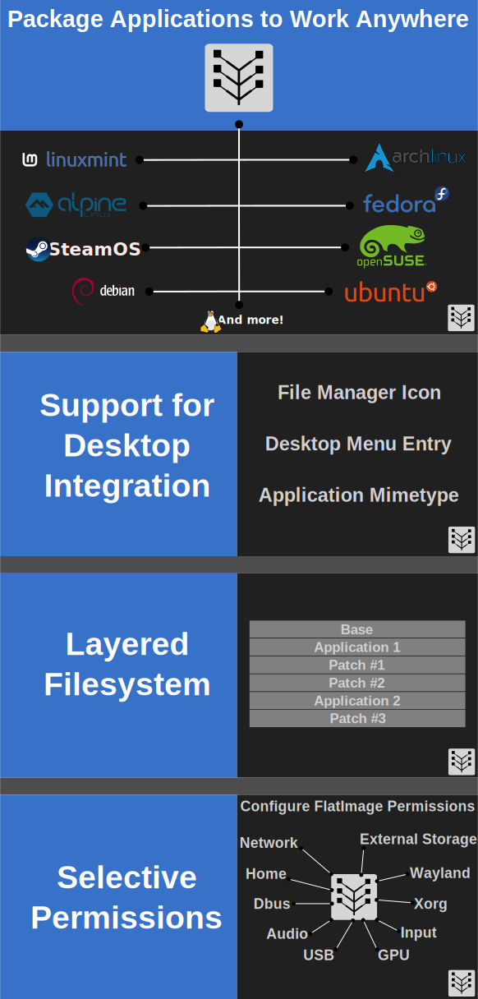

# Table of Contents

- [Documentation](#documentation)
- [FlatImage](#flatimage)
- [Related Projects](#related-projects)

# Documentation

# FlatImage

# Related Projects

- [https://github.com/Kron4ek/Conty](https://github.com/Kron4ek/Conty)
- [https://github.com/genuinetools/binctr](https://github.com/genuinetools/binctr)
- [https://github.com/Intoli/exodus](https://github.com/Intoli/exodus)
- [https://statifier.sourceforge.net/](https://statifier.sourceforge.net/)
- [https://github.com/matthewbauer/nix-bundle](https://github.com/matthewbauer/nix-bundle)
- [https://github.com/containers/bubblewrap](https://github.com/containers/bubblewrap)
- [https://github.com/proot-me/proot](https://github.com/proot-me/proot)

<!-- // cmd: !./doc/toc.sh
